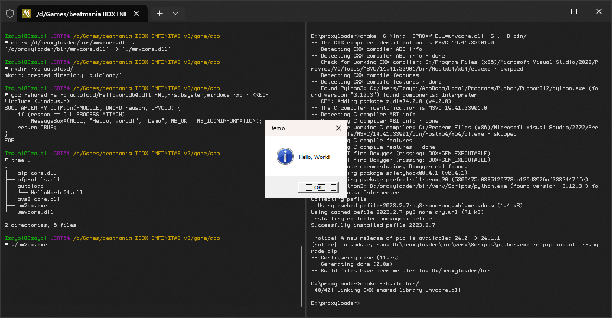

# proxyloader

Generates a proxy DLL capable of loading in additional libraries

Works with both 32-bit and 64-bit executables, but untested with compilers other than Visual C++

- During CMake configuration, calls [**perfect-dll-proxy**](https://github.com/mrexodia/perfect-dll-proxy) to generate forwarding exports to the original library
- Uses [**SafetyHook**](https://github.com/cursey/safetyhook) in `DllMain` to intercept the executable entrypoint and load additional libraries

Mainly intended for my own quick prototyping use, but made available here in case anyone else finds it useful. Not extensively tested and probably won't work in all applications. Use at your own risk, etc. etc.

## Usage

- Open a new Visual Studio Developer Command Prompt instance
- Run CMake with `PROXY_DLL` set to a system library filename — for example:
```bash
# 32-bit
cmake -A Win32 -DPROXY_DLL=winmm.dll -S . -B bin32/
cmake --build bin32/ --config Release

# 64-bit
cmake -A x64 -DPROXY_DLL=d3d9.dll -S . -B bin64/
cmake --build bin64/ --config Release
```
- Copy the generated library to the same directory as the target executable
- Place one or more libraries to load in one of the following locations:
  - `autoload` directory
  - `autoload.txt` and/or `chainload.txt` text files
    - One path per line. Lines starting in `#` are treated as comments and ignored
- Start the target executable as you would normally

The Visual C++ runtime is statically linked by default to hopefully make distribution less painful. This can be disabled by passing `-DSTATIC_MSVC_RUNTIME=OFF` during CMake configuration